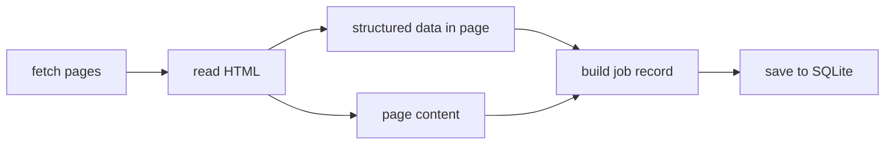
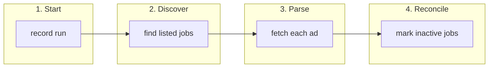

# Job scraper

> **Disclaimer — educational use only.** This project is for learning about scraping and data pipelines, not production or commercial use. The target marketplace prohibits automated, systematic data collection without written permission. Unauthorized use may lead to access blocks, account bans, or civil/copyright claims. Read the site's terms and `robots.txt` before use. Not legal advice.

Collects job listings from a Norwegian classifieds marketplace and saves them to a SQLite database file.

## Quick start

Clone the repo, then run everything from inside the `job_scraper` folder. Output goes to `data/jobs.sqlite3`. A full run takes a while.

### Windows — first time

```powershell
git clone https://github.com/Johannes-T-E/job_scraper.git
cd job_scraper
python -m venv .venv
.venv\Scripts\activate
pip install -r requirements.txt
python run_scraper.py
```

### Windows — every run after

```powershell
cd job_scraper
.venv\Scripts\activate
python run_scraper.py
```

### Mac / Linux — first time

```bash
git clone https://github.com/Johannes-T-E/job_scraper.git
cd job_scraper
python3 -m venv .venv
source .venv/bin/activate
pip install -r requirements.txt
python3 run_scraper.py
```

### Mac / Linux — every run after

```bash
cd job_scraper
source .venv/bin/activate
python3 run_scraper.py
```

When it finishes, open `data/jobs.sqlite3` with any SQLite viewer, or query it from Python (see [Examples](#examples)).

## Running again

You can run the scraper as often as you like. Each run is saved so you can see what was listed at different points in time.

- **Still listed** — the job stays active; title, employer, and other fields update if parsing succeeds.
- **New job** — added to the database with a first-seen timestamp.
- **No longer listed** — marked inactive with a deactivation timestamp; the row is kept so you can see when it was live.

A job counts as listed if it appeared in search results during that run, even if fetching the full ad page failed.

See [How it works](#how-it-works) for the full picture, or [Example queries](#example-queries) to explore the data.

## Use in another project

Copy this entire folder into your project, install dependencies once, then start a scrape from Python:

```python
from pathlib import Path
from job_scraper import run_scrape

run_scrape(db_path=Path("data/jobs.sqlite3"))
```

Your app reads the same SQLite file to show jobs in a web UI or API. The scraper only writes the file.

## Examples

### Full scrape (Python)

```python
from pathlib import Path
from job_scraper import run_scrape

result = run_scrape(db_path=Path("data/jobs.sqlite3"))
print(result.scrape_id, result.active_count, result.deactivated_count)
```

### Parse one ad (CLI)

```bash
python parse_job_ad.py "<job-ad-url>"
python parse_job_ad.py "<job-ad-url>" --out job.json
```

### Run scrape in the background (webapp / scheduler)

```python
import threading
from pathlib import Path
from job_scraper import run_scrape

def refresh_jobs():
    run_scrape(db_path=Path("data/jobs.sqlite3"), workers=4)

threading.Thread(target=refresh_jobs, daemon=True).start()
```

Or as a subprocess:

```python
import subprocess

subprocess.run(["python", "-m", "job_scraper"], check=True)
```

### Read scraped jobs

```python
import sqlite3

conn = sqlite3.connect("data/jobs.sqlite3")
conn.row_factory = sqlite3.Row
rows = conn.execute(
    "SELECT finn_code, title, employer, url FROM jobs WHERE is_active = 1 LIMIT 50"
).fetchall()
conn.close()
```

### Parse or discover without a full scrape

```python
from job_scraper import extract_finn_job, discover_all_job_urls

job = extract_finn_job("<job-ad-url>")
partitions, urls = discover_all_job_urls()
```

## Advanced: CLI options

Only needed if you want to change defaults. Run `python run_scraper.py --help` for the full list.

| Flag | Default | Description |
|------|---------|-------------|
| `--db` | `data/jobs.sqlite3` | Where to save the SQLite database |
| `--workers` | `8` | Parallel threads for fetching ad pages (`1` = one at a time) |
| `--discover-workers` | `8` | Parallel threads for browsing search results |
| `--delay` | `0` | Pause (seconds) after each ad page fetch |
| `--discover-delay` | `0` | Pause (seconds) during search browsing |

```bash
# Save to a different file
python run_scraper.py --db ../my_app/data/jobs.sqlite3

# If you see 429 errors, slow down
python run_scraper.py --discover-workers 4 --workers 4 --discover-delay 0.05

# One at a time (useful for debugging)
python run_scraper.py --discover-workers 1 --workers 1
```

## API reference

`run_scrape()` returns a `ScrapeResult`:

| Field | Meaning |
|-------|---------|
| `db_path` | SQLite file written |
| `scrape_id` | ID of this run — use it to look up which jobs were listed |
| `partitions` | How many search slices were needed to cover all listings |
| `urls_found` | Job ads found in search results |
| `ok` | Ads successfully fetched and parsed |
| `failed` | Ads found but failed to parse |
| `active_count` | Jobs listed in this run |
| `deactivated_count` | Jobs marked inactive at end of this run |
| `total_in_db` | Total jobs stored in the database |

```python
from job_scraper import run_scrape, ScrapeResult
from job_scraper import extract_finn_job, discover_all_job_urls, job_storage
```

A full scrape takes a long time — run it from a cron job, background thread, or subprocess, not inside a web request handler.

## Database

All output goes into one SQLite file (default: `data/jobs.sqlite3`). Three tables:

| Table | What it holds |
|-------|---------------|
| `jobs` | One row per job ad — latest title, employer, location, etc., plus whether it is currently listed |
| `scrapes` | One row per time you ran the scraper, with start time and counts |
| `scrape_jobs` | Which jobs were listed in each run |

Useful columns on `jobs`:

| Column | Meaning |
|--------|---------|
| `first_seen_at` | When the job first appeared |
| `last_seen_at` | When it was last seen listed |
| `is_active` | `1` = currently listed, `0` = no longer listed |
| `deactivated_at` | When it stopped appearing (if inactive) |
| `raw_json` | Full parsed payload as JSON |

### Example queries

```sql
-- Jobs listed in a specific run (replace 3 with a scrape_id)
SELECT j.* FROM scrape_jobs sj
JOIN jobs j ON j.finn_code = sj.finn_code
WHERE sj.scrape_id = 3;

-- Currently listed jobs
SELECT * FROM jobs WHERE is_active = 1;

-- How long a job was listed
SELECT finn_code, title, first_seen_at, last_seen_at, deactivated_at
FROM jobs WHERE finn_code = '460062297';

-- Past runs, newest first
SELECT id, started_at, finished_at, urls_discovered, ok, failed
FROM scrapes ORDER BY id DESC;
```

## How it works

What happens when you run the scraper, and what tools it uses to do it.

### Scraping approach

The scraper fetches web pages over HTTP and reads the HTML — like a browser, but without opening a window. There is no Selenium, Playwright, or headless Chrome.

That means fewer dependencies, faster runs, and you can schedule it on any machine with Python.



### Tools used

| Tool | What it does here |
|------|-------------------|
| **[httpx](https://www.python-httpx.org/)** | Downloads search pages and job ad pages |
| **[selectolax](https://github.com/rushter/selectolax)** | Reads HTML quickly — finds links, titles, descriptions |
| **SQLite** | Stores jobs and run history in one file |
| **Parallel threads** | Fetches many pages at once to speed up long runs |

Dependencies are listed in [`requirements.txt`](requirements.txt).

### Fetching pages

When you run a scrape, httpx requests pages with:

- **HTTP/2** for efficient connections
- **Browser-like headers** so requests look like a normal visit
- **Automatic retries** if the server returns rate limits (429) or temporary errors (5xx)

Search browsing and ad fetching can run in parallel. Use `--discover-workers` and `--workers` to control how many pages are fetched at once. If you hit rate limits, lower these values or add `--delay`.

### Extracting job data

Each job ad page is read in layers:

1. **Structured data (JSON-LD)** — most ads embed a standard `JobPosting` block in the page source. This gives title, employer, dates, and location when present.
2. **HTML content** — description sections, contact info, and fields missing from the structured data are read from the page layout.
3. **Meta tags and footer** — fallbacks for ad ID and last-updated time.
4. **Inline scripts** — some fields (sector, remote work, job type) are picked up from JavaScript embedded in the page.

Search result pages are handled more simply: the scraper collects links to individual job ads and uses location/occupation filters to make sure nothing is missed when there are thousands of listings.

### The four phases of a run



**1. Start** — A new run is recorded with a timestamp and ID (`scrape_id`).

**2. Discover** — The scraper walks search results across the whole marketplace. Because the site limits how many results one search can show (~2 500), it automatically splits the search by region and job category until every listing is reachable. Every ad link found is saved for this run.

**3. Parse** — Each ad page is fetched and turned into structured fields (title, employer, location, full description in `raw_json`, etc.).

**4. Reconcile** — Jobs that were active before but not found in this run are marked inactive. The run is closed with summary counts.
